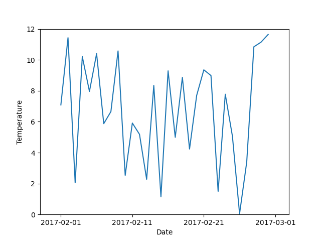

nc-time-axis
============

|Travis|_ |Coveralls|_

Support for cftime axis in matplotlib.

See also
--------

* `matplotlib <http://matplotlib.org/>`_
* `cftime <https://github.com/Unidata/cftime>`_

Installation
------------
::

    conda install -c conda-forge nc_time_axis

Example Code
------------
::

	import random

	import matplotlib.pyplot as plt
	import nc_time_axis
	import cftime

	d_time = [cftime.datetime(year=2017, month=2, day=n) for n in range(1, 31)]
	c_d_time = [nc_time_axis.CalendarDateTime(item, "360_day") for item in d_time]
	temperatures = [round(random.uniform(0, 12), 3) for _ in range(len(c_d_time))]

	plt.plot(c_d_time, temperatures)
	plt.margins(0.1)
	plt.ylim(0, 12)
	plt.xlabel("Date")
	plt.ylabel("Temperature")
	plt.show()

.. |Travis| image:: https://travis-ci.org/SciTools/nc-time-axis.svg?branch=master
.. _Travis: https://travis-ci.org/SciTools/nc-time-axis

.. |Coveralls| image:: https://coveralls.io/repos/github/SciTools/nc-time-axis/badge.svg?branch=master
.. _Coveralls: https://coveralls.io/github/SciTools/nc-time-axis?branch=master 
