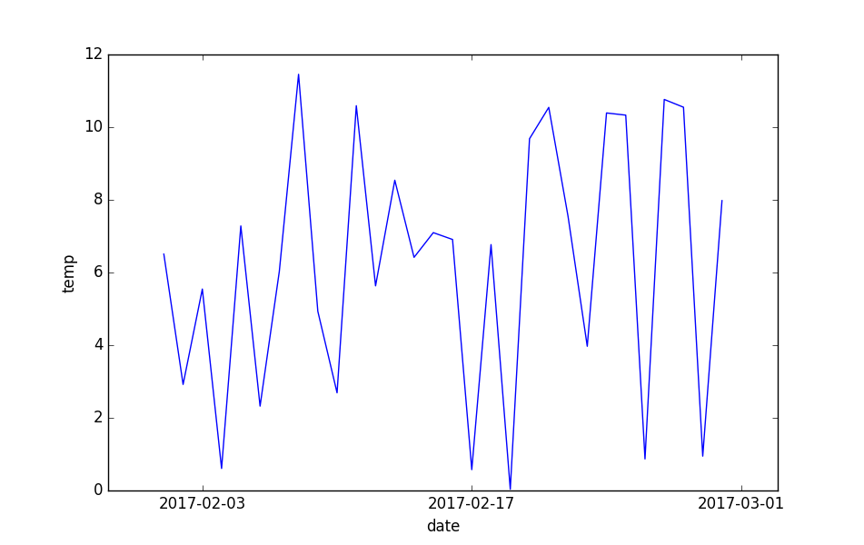

nc-time-axis
============

|Travis|_ |Coveralls|_

Support for netcdftime axis in matplotlib.

See also
--------

* `matplotlib <http://matplotlib.org/>`_
* `netcdftime <https://github.com/Unidata/netcdf4-python/blob/master/netcdftime/netcdftime.py>`_

Installation
------------
::

    conda install -c conda-forge nc_time_axis

Example Code
------------
::

    import nc_time_axis
	import netcdftime
	import matplotlib.pyplot as plt
	import random
	DT = [netcdftime.datetime(year=2017, month=2, day=day) for day in range(1, 31)]
	CDT = [nc_time_axis.CalendarDateTime(item, "360_day") for item in DT]
	TempList = []
	for item in range(30):
		DayTemp = round(random.uniform(0, 12), 3)
		TempList.append(DayTemp)
	plt.plot(CDT, TempList)
	plt.margins(0.1)
	plt.ylim(0, 12)
	plt.xlabel("date")
	plt.ylabel("temp")
	plt.show()

.. |Travis| image:: https://travis-ci.org/SciTools/nc-time-axis.svg?branch=master
.. _Travis: https://travis-ci.org/SciTools/nc-time-axis

.. |Coveralls| image:: https://coveralls.io/repos/github/SciTools/nc-time-axis/badge.svg?branch=master
.. _Coveralls: https://coveralls.io/github/SciTools/nc-time-axis?branch=master 
